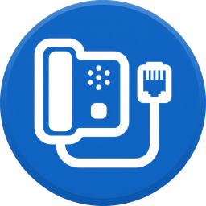
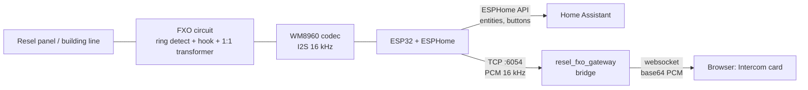

# Resel FXO HA Gateway

Answer your building intercom from Home Assistant: detect the ring, pick up, talk, and open the door, from the phone or a wall tablet.

The project connects the **interior unit of a Resel building intercom** (a phone-style "post interior" on a 2-wire POTS-like line) to **Home Assistant** through a small ESP32 + audio codec + discrete FXO circuit. It has three parts:

| Part | Folder | What it does |
|---|---|---|
| ESPHome component `audio_tcp` | [`components/audio_tcp`](components/audio_tcp) | TCP server on the ESP32 that streams the line audio out and plays audio received from a client |
| Home Assistant integration `resel_fxo_gateway` | [`custom_components/resel_fxo_gateway`](custom_components/resel_fxo_gateway) | Bridges the ESP32 audio port to the browser through the Home Assistant websocket, and serves the card |
| Lovelace card `resel-intercom-card` | [`custom_components/.../frontend`](custom_components/resel_fxo_gateway/frontend/resel-intercom-card.js) | Answer, hang up, push-to-talk, live line level, four custom buttons |

Everything else (ring detection, hook control, dialing, codec setup) is plain ESPHome YAML on the ESP32 and uses the standard Home Assistant ESPHome integration.

> **Status: hobby project, partly tested.** Ring detection, answering, hang-up, pulse and DTMF dialing, and audio from the intercom to the ESP32 work on the real line. See [Status](#status) for what is and is not verified.

---

## How it works



- **Control** (ring state, answer, hang up, door, PTT switch, levels) goes over the normal ESPHome API.
- **Voice** goes over a separate TCP connection from the ESP32 to Home Assistant, then over the Home Assistant websocket to the card. This is deliberately not SIP: it is small enough to run on a classic ESP32 without PSRAM.
- **Half duplex.** The official ESPHome `i2s_audio` cannot run the microphone and the speaker at the same time on one bus, so the line is either *listening* (microphone on) or *talking* (speaker on). The push-to-talk switch toggles between the two.

### Call flow

1. Someone rings from the panel. The ring detector latches, `Interfon Sonerie` turns on and a `esphome.resel_ring` event is fired.
2. **Pick up** lifts the hook (GPIO32 high) and starts listening. The card shows the line audio. It works whenever the line is on hook, not only while ringing, so you can start a call yourself (for example to dial a neighbour). **Hang up** puts the line back on hook.
3. **Hold to talk** turns the PTT switch on: the ESP32 stops the microphone, switches the speaker on and accepts audio from the card. Releasing returns to listening.
4. **Open door** (during the call) dials `0` (pulse or DTMF, selectable), keeps the line for a configurable time so you can hear what happens, then puts it back on hook. The panel ends the call after opening the door.
5. **Dial** sends any keys typed in the `Numar de Format` text field (digits, `*`, `#`, `A`-`D`) while the line is up, e.g. a neighbour's apartment number. If the text contains `*#A-D` DTMF is used automatically, otherwise the pulse/DTMF switch decides. The line must already be picked up (off hook); dialing waits until 1.5 s after the hook went up so the dial tone is there.

### Audio transport (`audio_tcp`)

Plain TCP, one client at a time (a newer client replaces the old one):

1. Client sends one ASCII line: `AUDIO1 <token>\n` (a wrong token closes the connection).
2. ESP32 → client: raw PCM, 16 kHz, 16-bit, mono, only while the line is being listened to.
3. Client → ESP32: raw PCM for the speaker, accepted only while PTT is on.

The Home Assistant side keeps **one** connection to the ESP32 and fans it out to every open card, so a phone and a wall tablet can watch the same call. The connection is opened only while at least one card is in a call. Websocket commands (`resel_fxo_gateway/subscribe_audio`, `resel_fxo_gateway/send_audio`) are admin-only. A third one, `resel_fxo_gateway/subscribe_settings`, sends the card its audio settings from the integration options and again whenever they change.

---

## What we know about the Resel system

- Resel "Interfon de scară cu carduri de proximitate": exterior central unit, power supply (5 V / 12 V / 48 V DC, 12 V battery backup recommended), floor distributors, and the interior post in each apartment, connected with RJ11 on 2 wires.
- The interior post is a wall-mounted keypad phone working in **tone (DTMF)** mode with a dual-tone ringer. It has a TONE/PULSE switch and a RINGER ON/OFF switch.
- Resel support: the line follows the PBX standard as closely as possible, and the ring signal is **75–120 V AC at about 27 Hz**.
- Measured on a multimeter: on hook the line sits around **50 V**; during a ring the AC voltage jumps to about **50–60 V** and drops to 0 in a repeating burst pattern.
- Measured with the ESP32 circuit: with the hook output high the line reads about **8 V**, the same as with the handset lifted.
- The speaker and microphone gain potentiometers are on the exterior central unit, not in the apartment.
- The street panel (ISCP-01N-50 MF) has software gains **u2 (microphone)** and **u1 (speaker)**, 0-19, adjusted from the panel keypad during a call after typing the settings access code and `*` (display shows `uu`; keys 3/6 = mic up/down, 1/4 = speaker up/down). The access code is set by the installer. If the visitor's voice is weak, raising u2 gives more than any gain on the ESP side, because it improves the signal before the noise.
- **The door opens with key `0`** (the post manual also lists 7, 8, 9 and 0 during a conversation). It works with both pulse and tone dialing. `#0` (or `007`) calls the building panel; in practice `#0` was also seen to open the door, which is simply treated as a feature.
- Other apartments are reached by dialing their number; this works with pulse and with DTMF.
- The panel closes the call after opening the door, so the firmware always puts the line back on hook after a door command.
- Calls last at most about one minute, so the firmware watchdog (v7h) releases the line after 1 minute.

Note: the commercial Emblyx controller for Resel systems offers Apple Home, Google Home and Alexa support, but at the time of writing no Home Assistant integration and no audio.

---

## Hardware

A short overview only; the full schematic is not part of this repository.

| Block | Part / value | Role |
|---|---|---|
| MCU | ESP32 DevKitC (WROOM-32E), ESPHome on ESP-IDF | Everything digital |
| Audio codec | WM8960 breakout, 24 MHz on-board oscillator, no MCLK pin | Line ↔ I2S, 16 kHz; codec PLL makes 12.288 MHz SYSCLK |
| Line isolation | 1:1 600 Ω audio transformer (SM-LP-5001) | Galvanic isolation for voice |
| Ring detection | Series 0.47 µF / 275 V capacitor, bridge, TVS, PC817-type optocoupler, RC network on `RING_DET` | High-impedance ring sensing |
| Hook control | Transistor driving an optocoupler + load resistor | Off-hook (answer, pulse dialing) |

ESP32 pins:

| Function | GPIO |
|---|---|
| I2C SDA / SCL (codec control, 0x1A) | 21 / 22 |
| I2S BCLK / LRCLK | 27 / 26 |
| I2S DACDAT (ESP32 → codec) | 25 |
| I2S ADCDAT (codec → ESP32) | 35 |
| Hook control (high = off-hook, held low by 10 kΩ resistors at boot) | 32 |
| Ring detection node (digital + ADC) | 34 |

Safety: the hook output is held low in hardware, so the line cannot go off-hook while the ESP32 is in reset or booting. The firmware also drops the line after a watchdog timeout. **The line side carries ring voltage (75–120 V AC); build and test with care.**

---

## Measured values

All measured on the real line of the author's apartment.

### Ring detection

| Item | Value |
|---|---|
| `RING_DET` node at rest | about 0.14 V (ADC offset) |
| Node on a ring (final circuit, R = 3 MΩ, C = 0.47 µF) | **2.8–3.1 V** peak |
| Time constant of the node | about 1.4 s |
| Time above the ESP32 digital threshold (≈ 2.5 V) on a short ring | about 0.3 s |
| Node with the first circuit (R = 330 kΩ, 4.7 µF electrolytic) | only 0.45–0.55 V, not detected |
| Digital filter | `delayed_on: 50 ms` |
| ADC detector (optional) | rise at ≥ 0.5 V, fall below 0.4 V |
| Ring hold time | 6 s without signal (the ring cadence has pauses of 2–4 s) |
| Lockout after any hook change | 4 s (the hook itself disturbs the node) |

### Dialing

| Item | Value |
|---|---|
| Pulse | 60 ms break + 40 ms make (10 pulses/s), 800 ms between digits, `0` = 10 pulses |
| DTMF | one continuous tone per key (default 450 ms) + gap (default 50 ms); works with 50-100 ms gaps, 90 ms was the most reliable; both are sliders. Tone level is its own slider (default -10 dB, 0 dB = amplitude 28000/32767), independent of the DAC |
| Wait after off-hook before dialing | fixed 1.5 s (only if dialing starts from on-hook; about 0.2 s if already in a call) |
| After the last key | 250 ms tail, then the microphone restarts (about 0.6 s after the last key); ring detection stays guarded by the arming rule |
| Pulse / DTMF | one switch in the firmware picks the mode for every key sent; `#0` (call the panel) is always DTMF |
| Door command cooldown | 10 s |

### Audio

| Item | Value |
|---|---|
| Format | 16 kHz, 16-bit, mono |
| Line noise floor (nobody speaking) | RMS about **−62 dBFS**, DC offset about 0 |
| Content | dominated by **50 Hz mains hum** and its odd harmonics |
| Band 300–3400 Hz | about **−72 dBFS** |
| Fix | notch comb on 50 Hz multiples + high-pass 300–350 Hz in the card (noise −63 → −83 dBFS) |
| Card level meter | `−90 dBFS` means the clamp floor (microphone stopped), not measured noise |
| Input gain (WM8960) | PGA -17.25...+30 dB plus boost 0/+13/+20/+29 dB. Noise scales 1:1 with the total, so the split does not change the SNR. Boost 29 + PGA 18-20 is a good starting point |
| Output level | DAC slider -73...+6 dB; it also sets the DTMF level together with the DTMF level slider |
| Streaming chunk | 40 ms (640 samples) |
| Playback jitter buffer in the card | about 120 ms, dropped if more than 800 ms behind |
| PTT safety timeout | 30 s on the ESP32 |

---

## Installation

### 1. ESP32 (ESPHome)

Add the external component from this repository:

```yaml
external_components:
  - source: github://sandreialexandru/Resel-FXO-HA-Gateway@main
    components: [audio_tcp]

audio_tcp:
  id: audio_hub
  port: 6054
  token: !secret audio_token      # any password; the same one goes into Home Assistant
  speaker: intercom_speaker       # your i2s_audio speaker
```

In the microphone `on_data` lambda, forward blocks with `id(audio_hub).push_mic((const uint8_t *) x.data(), bytes);`. On PTT switch on/off call `id(audio_hub).set_talk(true/false);`. The full firmware (codec init, ring detection, hook control, dialing, PTT) is not published here yet.

Needs ESP-IDF and a recent ESPHome (developed on 2026.9).

### 2. Home Assistant integration (HACS)

1. HACS → ⋮ → **Custom repositories** → add `https://github.com/sandreialexandru/Resel-FXO-HA-Gateway`, type **Integration**.
2. Download **Resel FXO HA Gateway** and restart Home Assistant.
3. Settings → Devices & services → **Add integration** → *Resel FXO HA Gateway*: host of the ESP32, port `6054`, token.
4. The card file is registered automatically. Hard refresh the browser after an update.
5. The integration's icon comes from its own `brand/` folder (Home Assistant 2026.3 or newer; older versions show the generic placeholder).

Manual install: copy `custom_components/resel_fxo_gateway` to `/config/custom_components/`.

> The browser microphone needs a **secure context**: open Home Assistant over **HTTPS** (or `localhost`, or the companion app with microphone permission granted).

### 3. Card

```yaml
type: custom:resel-intercom-card
entity_prefix: resel_fxo_gateway_interfon_    # or set every entity below
entities:
  state: sensor.resel_fxo_gateway_interfon_stare
  answer: button.resel_fxo_gateway_interfon_raspunde
  hangup: button.resel_fxo_gateway_interfon_inchide
  ptt: switch.resel_fxo_gateway_interfon_ptt
  level: sensor.resel_fxo_gateway_interfon_nivel_microfon_rms
show_timer: false
dial: false                # true = text field + Dial button under the custom buttons (needs the firmware's Numar de Format / Formeaza)
buttons:                  # 2 per row under the PTT button; with an odd count the last one is full width
  - name: Open door
    icon: mdi:door-open
    entity: button.resel_fxo_gateway_interfon_deschide_usa
  - name: Dial
    icon: mdi:phone-outgoing
    entity: button.resel_fxo_gateway_interfon_formeaza   # sends the keys typed in the firmware's "Numar de Format" field
    disabled_when: [idle]
  - name: Mute mic
    entity: switch.resel_fxo_gateway_interfon_mute_audio
    icon: mdi:microphone
    state_icons: { "on": mdi:microphone-off, "off": mdi:microphone }
    state_colors: { "on": red }
```

Card options (all optional; the value shown is the default). The audio and push-to-talk settings are not set here but in the integration, see [4. Audio settings](#4-audio-settings).


| Option | Default | What it does |
|---|---|---|
| `entity_prefix` | `resel_fxo_gateway_interfon_` | Prefix of the ESPHome entities. If your device name differs (for example a `hall_` area prefix), set this or list every entity under `entities`. |
| `entities` | derived from the prefix | Explicit entity ids: `state`, `answer`, `hangup`, `ptt`, `level` (and `door_open` for the default button, `dial_text` / `dial_button` for `dial: true`). Anything you set overrides the prefix. |
| `title` | `Intercom` | Card title. |
| `show_header` | `true` | Show the title and the state chip. |
| `show_level` | `true` | Show the level meter. |
| `show_timer` | `false` | While talking, show the elapsed time against `ptt_timeout`. |
| `dial` | `false` | Shows a text field and a *Dial* button (during a call only). The keys (`0-9 * # A-D`) are stored in the firmware's `Numar de Format` text entity and sent with `Formeaza`, for example to ring a neighbour. Entity ids come from the prefix (`text.<prefix>numar_de_format`, `button.<prefix>formeaza`) or from `entities.dial_text` / `entities.dial_button`. |
| `labels` | English | Override any UI text (for translation). |

**Buttons**

`buttons` is a list shown two per row under the talk button. With an odd number of buttons the last one takes the whole row (for example 3 buttons: two side by side, the third full width). Without the list you get only *Open door* (it works during a call, after *Pick up*). Each button takes:

| Key | What it does |
|---|---|
| `name`, `icon` | Label and `mdi:` icon. |
| `entity` | Any button, script, scene, switch or light; the card acts sensibly by domain. |
| `tap_action` | Instead of `entity`: `perform-action`, `toggle`, `more-info`, `navigate` or `url`. |
| `disabled_when` | List of states in which the button is greyed out: `idle`, `ringing`, `connecting`, `listening`, `talking`, `in_call`. |
| `state_icons`, `state_colors` | Per-state icon and color, for example for a mute switch. |

**Other**

- **card-mod:** the root is `<ha-card>` and every part has a class (`.header`, `.status`, `.meter`, `.answer`, `.hangup`, `.ptt`, `.custom`). Custom buttons expose `data-state`, for example `.custom[data-state="on"] { … }`.
- **Status strings:** the card expects the ESPHome text sensor to report `Inactiv`, `Suna`, `Conectare`, `In apel - ascult` and `In apel - vorbesc`.

**Troubleshooting: "Custom element doesn't exist: resel-intercom-card".** The integration loads the card by itself, so no Lovelace resource is needed. If you added one by hand earlier, delete it (Settings → Dashboards → Resources), otherwise the card is loaded twice, possibly in an old version. The card file is cached by the browser/companion app (its URL carries the version), so after the first download it is available at once, even when the app restarts on another network. If the error still shows up after switching networks, the script request itself failed: in the companion app use Settings → Companion app → Troubleshooting → *Reload frontend* (or clear the frontend cache).

### 4. Audio settings

The audio and push-to-talk settings live in the integration, so they are changed from the Home Assistant UI instead of the card YAML: **Settings → Devices & services → Resel FXO HA Gateway → Configure**. The form has three groups (Talking, Line audio: filters, Line audio: cleaning). Saving pushes the new values to every open card at once, also during a call: the line filters are rebuilt on the next audio frame, the microphone gain changes immediately and the browser microphone options apply from the next push-to-talk. Clearing a box returns it to its default.

Any of these keys can still be written in a card's YAML; there it overrides the integration's value for that card only (for example a higher `gain` on a wall tablet with a quiet speaker).

**Talking (push-to-talk)**

| Setting | Default | What it does |
|---|---|---|
| `ptt_mode` | `hold` | `hold`: talk while the button is pressed. `toggle`: tap to start, tap to stop. |
| `ptt_timeout` | `30` | Only used by `show_timer`: the maximum talk time shown next to the elapsed time (the card does not cut the call itself). |
| `mic_gain` | `1` | Gain applied to your microphone before it is sent to the line. |
| `mic_echo_cancel` | `true` | Browser echo cancellation on your microphone. |
| `mic_noise_suppress` | `true` | Browser noise suppression on your microphone. |
| `mic_auto_gain` | `true` | Browser automatic gain control on your microphone. Turn these three off if your voice sounds pumped or too quiet. |

**Line audio: filters** (what you hear from the line)

| Setting | Default | What it does |
|---|---|---|
| `gain` | `2` | Playback gain. Lower it when you enable the leveler, which adds gain of its own. |
| `highpass_hz` | `250` | High-pass cutoff, removes low-frequency rumble (0 = off). |
| `lowpass_hz` | `3400` | Low-pass cutoff, removes hiss above the voice band. |
| `notch_hz` | `50` | Mains hum filter: narrow notches on this frequency and its multiples (`60` for 60 Hz grids, `0` = off). |
| `notch_max_hz` | `1500` | Highest harmonic that gets a notch. |
| `notch_q` | `30` | Notch sharpness; higher means narrower notches. |

**Line audio: cleaning** (processing order: spectral noise reduction → leveler → filters)

| Setting | Default | What it does |
|---|---|---|
| `spectral_nr` | `true` | Spectral noise reduction: learns the steady line noise (hum comb and hiss) from the quietest 1.5 s and subtracts it, also while someone speaks. Latency 24 ms. |
| `spectral_nr_strength` | `3` | How much of the estimated noise is subtracted (2-4 useful). Higher = cleaner, but can sound thin or watery. |
| `spectral_nr_floor_db` | `18` | The most any frequency is attenuated, in dB. |
| `leveler` | `false` | Slow automatic gain that brings quiet voices up to a constant level, followed by a soft limiter. |
| `leveler_target_db` | `-24` | Target voice level in dBFS. |
| `leveler_max_gain_db` | `15` | Largest boost the leveler may apply. |

**About the cleaning chain.** Earlier versions had a neural suppressor (RNNoise) and a noise gate. Both were removed. On a real recording of a weak, hum-laden line, RNNoise cut 40-48 % of the voice frames by more than 15 dB (words came out in pieces, and raising the level into it changed nothing), and the gate only added abrupt cuts once the spectral reduction had cleaned the pauses. The same recording went from about 12 dB to about 19-22 dB signal-to-noise with the spectral reduction and almost no cut frames. It works because the line noise is steady: hum, its harmonics and hiss. It is not meant for changing noise such as a crowd. If the voice is quiet, enable `leveler` and keep `gain` around 4-6; with the leveler on, keep `leveler_max_gain_db` modest because it also lifts the remaining noise between words.

**Hum filter.** The line noise is mostly 50 Hz and its harmonics. On a recording of the idle line the notch comb took the noise from −63 dBFS to −83 dBFS (high-pass/low-pass alone: −73 dBFS).

---

## Status

**Works on the real line**

- Ring detection (digital and optional ADC), including the 6 s hold and the post-hook lockout
- Off-hook, hang-up, 1-minute watchdog
- Pulse dialing: door opens with `0`, other numbers can be dialed
- DTMF dialing for the building panel (`#0`) and for other apartments (free dial field, with adjustable tone, gap and level)
- Continuous real-time audio from the intercom to the ESP32 and over TCP to a client
- Token handshake, PTT switch, microphone/speaker hand-over in the ESP32 logs

**Verified in a test environment only**

- The bridge against a simulated ESP32 (token ok / wrong token / no server, odd-length reads)
- The card in a headless browser with a simulated Home Assistant (states, PTT streaming, buttons, `disabled_when`, `state_icons`, settings pushed from the integration, odd button full width)
- The options form and the live settings push in a Home Assistant test instance

**Not yet verified**

- Voice level of the visitor is still low; raising the panel's u2 software gain is the next step
- Intelligibility of the voice sent *to* the panel
- Door opening with a DTMF `0` in every situation (it works with 450 ms tones; pulse also works)
- Microphone permission and audio in the Home Assistant companion app and Fully Kiosk
- Running with several cards open at the same time on real devices

**Known limits**

- Half duplex only (push-to-talk), single ESP32 client at a time
- Latency and quality are those of a 16 kHz PCM stream over websocket, with no echo cancellation on the line side
- No visual card editor (card layout in YAML; audio settings in the integration options)
- Tested on classic ESP32 + WM8960; other codecs would need their own init and gain tuning

---

## Repository layout

```
components/audio_tcp/                 ESPHome external component (C++)
custom_components/resel_fxo_gateway/  Home Assistant integration
  frontend/resel-intercom-card.js     Lovelace card
hacs.json                             HACS metadata
.github/workflows/release.yml         creates a release when the manifest version changes
```

## Credits

Built with the help of Claude (Anthropic).
